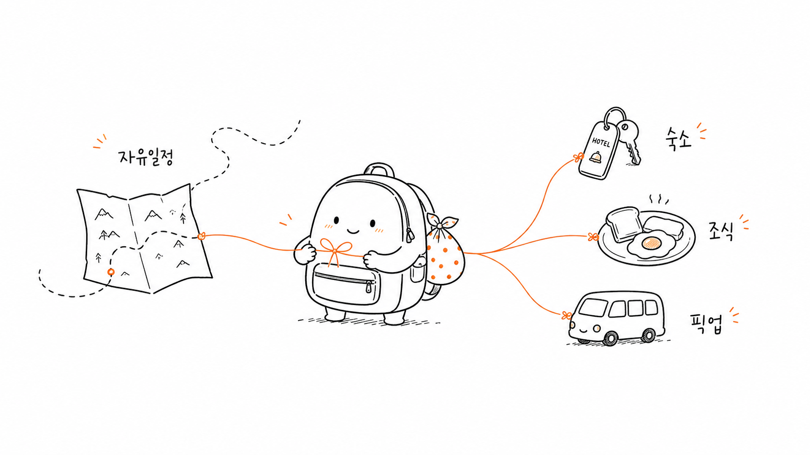
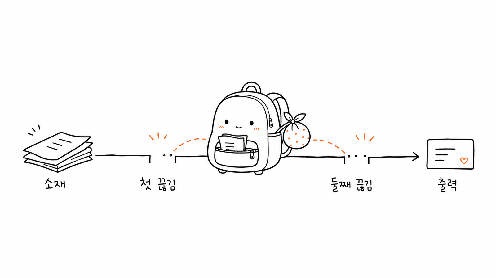
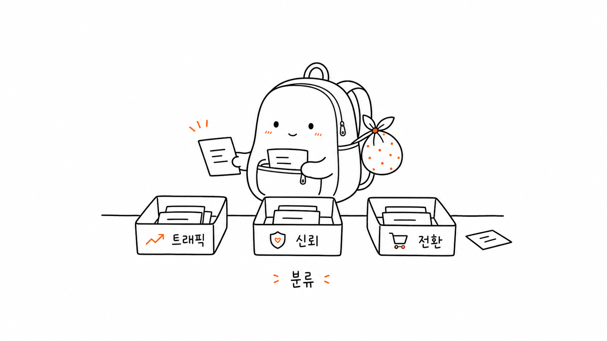
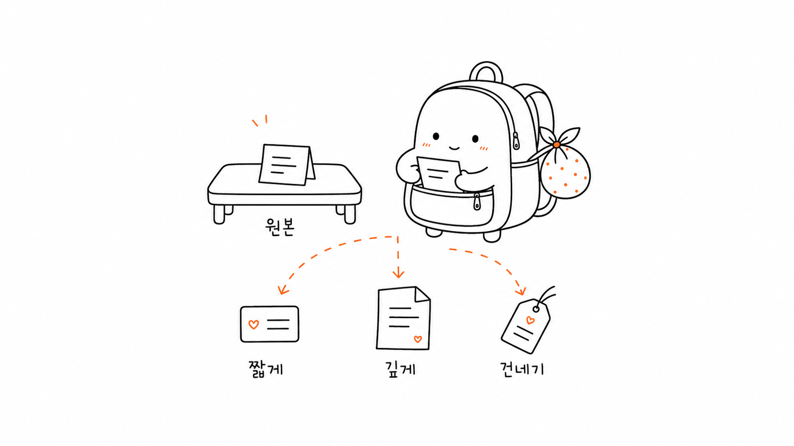
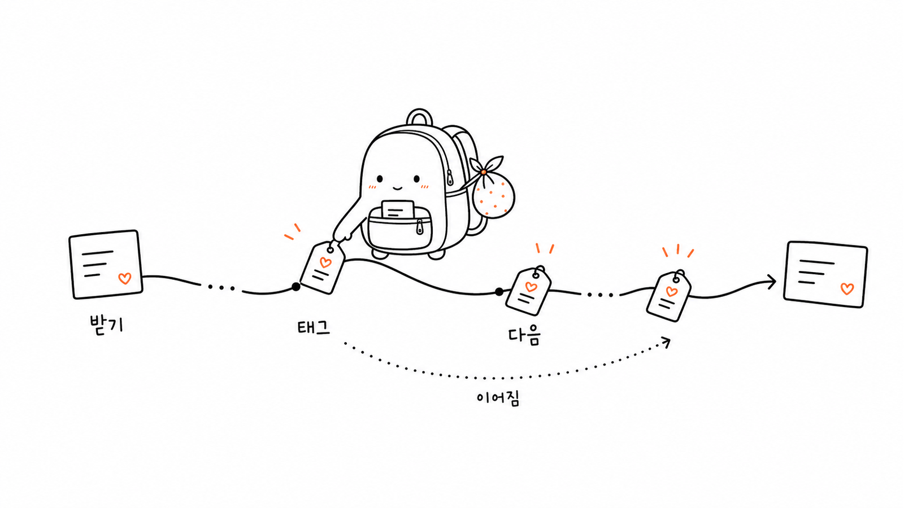
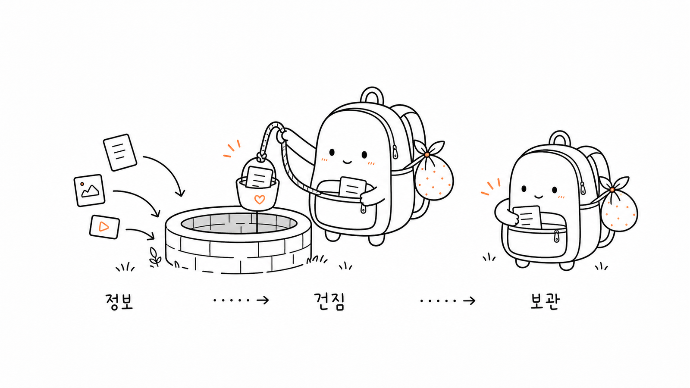
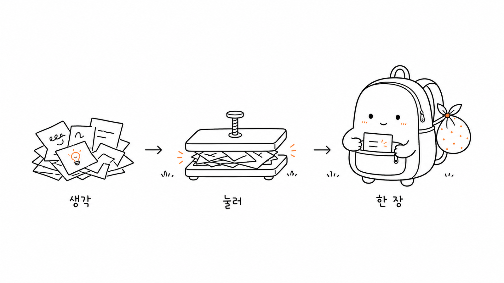
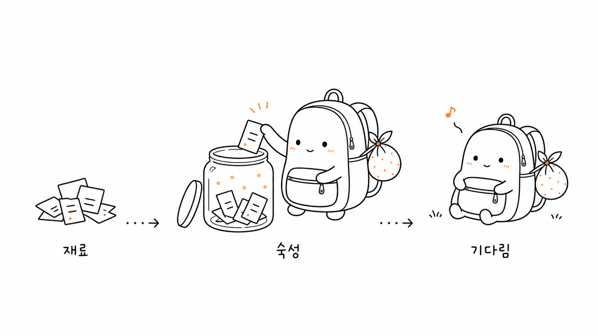
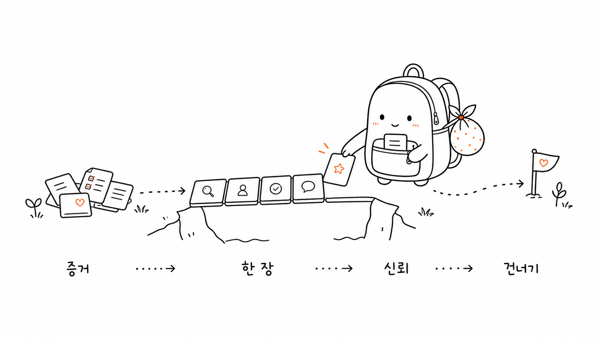

# Bottari Illust

> 한국어 글 안의 판단, 흐름, 상태, 은유를 흰 배경의 손그림 삽화로
> 바꿉니다. 작고 둥근 여행용 배낭 캐릭터 "보따리"가 글의 핵심
> 개념을 조용히 운반하고 정리하는 본문용 삽화 스킬입니다.
> 보따리는 하나투어 하나프리팩의 "자유여행의 자율성과 패키지의
> 편리함을 함께 담는" 아이디어에서 출발했습니다.
>
> 16:9 가로형 | 보따리 배낭 캐릭터 | 순백 손그림 | 검은 라인아트 | 소량의 오렌지 포인트 | Codex 스킬

---

## 이 저장소는 무엇인가

Bottari Illust는 AI 에이전트가 글이나 작업 자료,
방법론 콘텐츠에 어울리는 본문 삽화를 만들도록 안내하는 Codex
스킬입니다.

이 스킬의 캐릭터 "보따리"는 하나투어 하나프리팩에서 출발한
시각적 해석입니다. 하나프리팩이 가진 자유여행의 자율성, 패키지의
편리함, 현지에서 필요한 작은 도움을 "작은 여행 배낭이 필요한 단서를
챙기고 묶어 준다"는 은유로 옮겼습니다.

이 스킬은 범용 일러스트 프롬프트도, PPT 정보 그래픽 템플릿도 아닙니다.
핵심 목표는 글 안의 인지적 앵커를 먼저 이해한 뒤, 그중 하나의 판단,
흐름, 구조, 상태 또는 은유를 기억에 남는 16:9 손그림 설명 그림으로
바꾸는 것입니다.

기본 캐릭터는 "보따리"입니다. 보따리는 작고 둥근 여행용 배낭
캐릭터입니다. 검은 손그림 선으로 앞주머니, 지퍼, 어깨끈, 작은 고리를
간결하게 표현하고, 옆이나 뒤쪽에는 오렌지 점무늬가 있는 작은 보자기
꾸러미를 묶어 둡니다. 얼굴은 작은 눈 두 개와 은은한 미소만 사용합니다.

한 문장으로 말하면, **AI가 단순히 "그림 한 장을 붙이는" 수준을 넘어
글 속의 핵심 인지 동작 하나를 작고 차분한 여행 손그림으로 그리게 만드는
스킬**입니다.

이 저장소는 하나투어 공식 브랜드 자산이나 공식 일러스트 시스템이
아닙니다. 보따리는 하나프리팩의 상품적 아이디어에서 영감을 받은
비공식 캐릭터이며, 실제 서비스에 사용할 때는 브랜드 로고, 상품명,
가격, 출발일, 예약 상태처럼 변동되거나 권리가 걸린 정보는 원문 확인 후
별도로 관리해야 합니다.

---

## 권리와 사용 범위

"보따리" 캐릭터의 이름, 설정, 외형, 시각적 정체성에 대한 권리는
저작자가 보유합니다. 보따리 캐릭터를 별도 캐릭터 IP처럼 재사용하거나,
공식 브랜드 자산으로 오해될 수 있는 방식으로 사용하지 마세요.

그 외 이 저장소의 스킬 문서, 프롬프트 구조, 설정 파일, 작업 흐름,
예시 구성 등 코드베이스 성격의 자료는 자유롭게 사용, 복제, 수정,
배포할 수 있습니다.

---

## 캐릭터의 출발점

보따리는 "여행에 필요한 것을 대신 챙겨 주는 작은 배낭"입니다. 태생은
하나프리팩의 핵심 감각과 맞닿아 있습니다.

- 자유여행처럼 스스로 고를 수 있는 여백
- 패키지처럼 공항 픽업, 숙소, 조식, 보험 같은 기본 도움
- 여행자가 놓치기 쉬운 작은 쿠폰, 지도, 바우처, 준비물
- 쇼핑, 선택관광, 자유일정처럼 상품마다 달라지는 조건

그래서 보따리는 단순한 마스코트가 아니라 **자유와 편의를 한데 묶는
작은 정리자**로 행동해야 합니다. 상품 정보를 그릴 때도 가격표나 광고
문구를 크게 외치는 대신, 보따리가 항공권, 호텔 키, 조식 쿠폰, 지도,
선택지 표지판 같은 작은 단서를 조용히 챙기고 정리하는 장면이 잘 맞습니다.

이 출발점은 여행 상품뿐 아니라 방법론, 워크플로, 지식형 글에도 이어집니다.
어떤 글이든 "여행자가 길 위에서 필요한 조각을 하나씩 챙긴다"는 감각으로
핵심 판단을 작게 운반하고, 묶고, 내려놓는 것이 이 스킬의 기본 태도입니다.

## 누구에게 맞는가

특히 잘 맞는 경우:

- 한국어 글을 쓰며 본문 삽화나 글 중간 이미지가 필요한 사람
- 여행 상품, 기획전, 패키지 설명을 부드러운 본문 삽화로 바꾸고 싶은 사람
- 지식형 콘텐츠, 방법론 콘텐츠, AI 워크플로 콘텐츠를 만드는 사람
- 추상적인 판단을 구체적인 은유로 시각화하고 싶은 사람
- PPT 정보 그래픽보다 더 가볍고, 더 조용하고, 더 개인적인 식별성이 있는 삽화 스타일을 원하는 사람
- Codex로 콘텐츠를 만들면서 안정적으로 재사용할 시각 언어가 필요한 사람

맞지 않는 경우:

- 상업용 일러스트, 브랜드 키 비주얼, 정교한 플랫 일러스트를 원하는 사람
- 전통적인 PPT 정보 그래픽, 복잡한 아키텍처 다이어그램, 흐름도를 원하는 사람
- 어린이풍 만화, 과장된 캐릭터 IP, 밈 스타일을 원하는 사람
- 긴 본문, 긴 설명, 전체 강의 페이지를 그림 한 장에 밀어 넣고 싶은 사람
- 엄격하게 편집 가능한 벡터 원본 파일이 필요한 사람

---

## 무엇을 만들어 주는가

기본 산출물:

- 16:9 가로형 본문 삽화
- 글 한 편에 대한 4-8장의 샷 목록
- 각 그림의 주제, 핵심 의미, 구조 유형, 보따리 동작, 한국어 표기 제안
- 최종 PNG 이미지, 워크스페이스의 `assets/<article-slug>-pocket/`에 저장

기본적으로 만들지 않는 것:

- PPTX / PDF / Keynote
- SVG / HTML / Canvas 편집용 그림
- 상업 포스터나 표지용 키 비주얼
- 긴 글이 들어간 정보 그래픽

---

## 시각 스타일

이 스킬은 기본적으로 "여행보따리 캐릭터 스타일"을 사용합니다.

- 순백 배경. 종이 질감, 베이지색, 그림자, 그라데이션 없음
- 검은색 손그림 선화. 가는 선, 약간 흔들리는 느낌
- 넉넉한 여백. 주요 피사체는 화면의 약 40%-60%
- 오렌지 포인트는 보자기 점무늬, 짧은 홍조, 작은 강조선에만 소량 사용
- 한 장은 하나의 핵심 동작, 구조, 상태 또는 은유만 표현
- 보따리는 작고 둥근 여행용 배낭으로 보여야 함
- 앞주머니, 지퍼, 어깨끈, 작은 고리, 오렌지 점무늬 보자기 꾸러미 중 최소 세 가지 단서가 필요
- 보따리는 핵심 동작에 반드시 참여해야 하며 장식이면 안 됨
- 여행 상품을 다룰 때는 항공권, 호텔 키, 지도, 조식 쿠폰, 픽업 표지,
  선택지 갈림길처럼 상품의 성격을 암시하는 작은 소품을 우선 사용
- 귀엽지만 절제되어야 하며, 유치한 아동 낙서나 과장된 만화 마스코트처럼 보이면 안 됨

---

## 예시

### 하나프리팩 하이브리드



### 두 개의 끊김점



### 목적별 분류



### 하나의 소재를 여러 용도로 쓰기



### 이어받는 경로



### 정보 우물



### 아이디어 압착기



### 콘텐츠 숙성



### 신뢰의 다리



이 이미지는 새 보따리 배낭 캐릭터 기준으로 재생성한 예시입니다. 사용할
때는 현재 글에서 은유를 새로 발명해야 하며, 기존 사례의 물건과 구도를
그대로 베끼면 안 됩니다.

---

## 캐릭터 기준

캐릭터의 최종 기준은 [bottari-illust/references/bottari-character.md](bottari-illust/references/bottari-character.md)입니다.

기존 `examples/images/`와 `bottari-illust/assets/examples/`의 이미지는
구도 복제 방지와 선 밀도 참고용으로만 봅니다. 새 보따리의 외형 기준으로
삼지 마세요. 새 이미지 생성 시에는 반드시 `bottari-character.md`의 배낭
캐릭터 정의를 우선합니다.

---

## 설치

저장소를 복제합니다.

```bash
git clone https://github.com/landfill/bottari-illust.git
cd bottari-illust
```

스킬을 Codex 스킬 디렉터리로 복사합니다.

```bash
mkdir -p "${CODEX_HOME:-$HOME/.codex}/skills"
cp -R ./bottari-illust "${CODEX_HOME:-$HOME/.codex}/skills/"
```

설치 후 Codex에서 이렇게 사용합니다.

```text
$bottari-illust로 이 글을 위한 보따리 배낭 본문 삽화 5장을 설계하고 생성해 주세요.
```

---

## 사용법

### 삽화 기획만 하기

```text
$bottari-illust로 먼저 이미지는 생성하지 말고 작업해 주세요.
아래 글에서 삽화로 만들 만한 지점을 분석하고, 약 5장의 샷 목록을 출력해 주세요.
각 그림마다 어느 문단 뒤에 넣을지, 주제, 핵심 의미, 구조 유형, 보따리가 하는 일, 추천 한국어 표기어를 써 주세요.

<글 붙여넣기>
```

### 본문 삽화 바로 생성하기

```text
$bottari-illust로 아래 글을 보따리 배낭 본문 삽화 4장으로 만들어 주세요.
요구사항: 16:9 가로형, 순백 배경, 검은색 손그림 선화, 오렌지 포인트 소량.
보따리는 작고 둥근 여행용 배낭이며, 앞주머니와 오렌지 점무늬 보자기 꾸러미가 보여야 합니다.

<글 붙여넣기>
```

### 여행 상품 링크를 본문 삽화로 만들기

```text
$bottari-illust로 아래 여행 상품 링크의 핵심 정보를 읽고,
보따리 배낭 본문 삽화 4장을 설계하고 생성해 주세요.

중요:
- 가격, 출발일, 예약 상태처럼 변동되는 정보는 그림에 직접 쓰지 마세요.
- 브랜드 로고나 실제 상품 배너를 복제하지 마세요.
- 보따리가 항공권, 호텔 키, 조식 쿠폰, 지도, 픽업 표지,
  선택지 갈림길을 조용히 정리하는 장면으로 표현해 주세요.
- 각 그림마다 보따리의 방향과 자세를 다르게 해 주세요.

<여행 상품 링크>
```

### 단일 개념을 그림 한 장으로 만들기

```text
$bottari-illust로 "신뢰는 외쳐서 생기는 것이 아니라,
증거를 한 장씩 깔아 만든 길이다"라는 개념을
본문 삽화 한 장으로 만들어 주세요.
화면은 차분하고 산뜻해야 하고, 보따리가 핵심 증거를 조용히 운반해야 합니다.
```

### 그림 속 제목이나 잘못된 글자 제거하기

```text
$bottari-illust로 이 그림을 편집해 주세요. 왼쪽 위의 "흐름도" 제목을 제거하고, 다른 내용은 그대로 유지해 주세요.
```

더 많은 예시는 [examples/prompts.md](examples/prompts.md)를 참고하세요.

---

## 작업 흐름

이 스킬의 흐름은 다음과 같습니다.

1. 글, 자료, 링크, 스크린샷 또는 사용자가 준 주제를 읽습니다.
2. 핵심 주장, 인지적 전환, 흐름 구조, 시각화하기 좋은 문단을 추려냅니다.
3. 먼저 샷 목록을 출력합니다. 각 그림은 하나의 인지 앵커만 선택합니다.
4. 각 그림에 맞는 구조 유형을 고릅니다. 워크플로, 시스템 일부,
   전후 비교, 역할 상태, 개념 은유, 방법의 층위, 지도 경로,
   짧은 만화 컷 중에서 선택합니다.
5. 낮은 기술감의 물리적 은유를 새로 발명합니다. 차분하지만 기억에 남아야 합니다.
6. 보따리가 핵심 동작을 맡게 합니다.
7. 각 그림을 별도로 이미지 모델에 생성 요청합니다.
8. QA 체크리스트로 확인합니다. 흰 배경, 여백, 배낭 캐릭터 단서,
   보따리 동작, 한국어 표기, PPT 느낌 배제, 기존 예시 복제 금지를
   점검합니다.
9. 최종 PNG를 글 단위 보따리 포켓 경로에 저장하고, 용도와 경로를 보고합니다.

---

## 디렉터리 구조

```text
.
├── README.md
├── assets/
│   └── <article-slug>-pocket/
│       ├── 01-topic-name.png
│       └── 02-topic-name.png
├── examples/
│   ├── images/
│   │   ├── 01-two-breakpoints.png
│   │   ├── 02-sort-by-purpose.png
│   │   └── ...
│   └── prompts.md
└── bottari-illust/
    ├── SKILL.md
    ├── agents/
    │   └── openai.yaml
    ├── assets/
    │   └── examples/
    └── references/
        ├── bottari-character.md
        ├── bottari-style.md
        ├── bottari-composition.md
        ├── bottari-prompt.md
        └── bottari-qa.md
```

Codex에 실제로 설치해야 하는 것은 하위 디렉터리입니다.

```text
bottari-illust/
```

루트의 README와 examples는 GitHub 공유용 문서입니다.

---

## 주의사항

- 그림 안의 한국어 글자는 짧을수록 안정적입니다.
- 한 그림은 하나의 핵심 구조만 설명해야 합니다. 글 전체를 설명서처럼 만들지 마세요.
- 보따리는 핵심 동작을 맡아야 합니다. 보따리를 지워도 그림이 완전히 성립한다면 장식으로 쓰인 것입니다.
- 하나프리팩에서 출발한 캐릭터이지만, 하나투어 공식 로고나 실제 상품
  키 비주얼을 복제하는 용도가 아닙니다.
- 여행 상품을 다룰 때는 원문 링크에서 확인한 사실만 쓰고, 가격,
  출발일, 좌석, 예약 가능 여부 같은 변동 정보는 이미지 안에 직접 넣지 마세요.
- 예시 그림은 선 밀도, 여백, 색 절제, 복제 금지 구도 확인용입니다. 새 캐릭터 외형은 `bottari-character.md`를 따르세요.
- AI 이미지 모델은 오탈자, 환각 라벨, 스타일 흔들림, 불필요한 제목을 만들 수 있으므로 생성 후 확인이 필요합니다.
- 한국어 오탈자가 심하면 표기어를 먼저 줄이고 다시 생성하세요.

---
